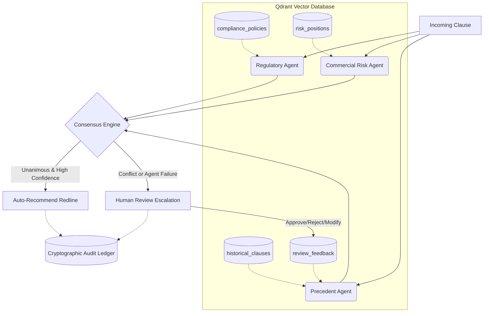

# Redline Consensus Engine

## Problem & Approach

Single-LLM contract review systems are dangerously inconsistent, routinely hallucinating compliance advice, and completely lack the verifiable audit trails required by enterprise legal departments. **Redline Consensus Engine** solves this by routing every contractual clause through a parallel *consensus-of-agents*—where distinct Regulatory, Commercial, and Precedent agents independently assess risk using their own specialized sub-collections in a vector database. The Consensus Engine compares their findings: if they align, it auto-generates a redline; if they disagree or any agent fails, it automatically escalates the clause to a human reviewer. Every decision, whether automated or human, is cryptographically logged into a blockchain-style audit ledger to ensure absolute traceability.

For the full specification, read the [PRD.md](PRD.md).

## Architecture



## Quick Start

Run these exact commands to spin up the system locally.

1. **Start Qdrant (Vector Database):**
   ```bash
   docker run -p 6333:6333 -p 6334:6334 \
       -v $(pwd)/qdrant_storage:/qdrant/storage:z \
       qdrant/qdrant
   ```

2. **Install Dependencies:**
   ```bash
   pip install -r requirements.txt
   ```

3. **Configure Environment:**
   Copy `.env.example` to `.env` and insert your Gemini API Key. (Ensure Qdrant URL points to localhost:6333).
   ```bash
   cp .env.example .env
   # Edit .env with your GOOGLE_API_KEY
   ```

4. **Seed the Database:**
   ```bash
   python setup_db.py
   ```

5. **Launch the Application:**
   ```bash
   streamlit run app.py
   ```

## Judging Highlights

To see the system's strongest differentiators in under a minute, open the Streamlit UI and try these exact actions:

### 1. Try this to see it fail safely (Tab 2)
In the real world, agents crash or APIs time out. Go to **Tab 2 (Fault Injection Demo)**, select an agent (e.g., Regulatory) and force a `timeout` or `crash`. Click **"Inject Fault & Run"**. Instead of throwing a raw traceback that takes down the pipeline, watch the Consensus Engine safely trap the failure, issue an `agent_failure` escalation tier, and elegantly fall back to the Human Review queue. 

### 2. Try this to see the sweep (Tab 3)
When regulations change, you need to know which past contracts are now non-compliant. Go to **Tab 3 (Compliance Sweep)**. Enter a strict new privacy policy (e.g., *"Providers must delete personal data within 15 days, no exceptions."*) and hit **Run Sweep**. The engine instantly embeds the new policy, scans the entire historical database, runs the Regulatory agent over the matches, and outputs a surgical list of explicitly flagged clauses that now breach your new standard.

## What's Simulated vs. Production-Ready

To build this over a hackathon weekend, we made deliberate architectural trade-offs that are ready to scale post-launch:

- **Embeddings:** We currently use `fastembed` (BAAI/bge-small-en) running locally to avoid API latency during the demo. In production, this swaps seamlessly to **Google Vertex AI Text Embeddings** via the Qdrant client.
- **Audit Ledger:** The cryptographic hash chain is currently stored in a local **SQLite** database (`audit.db`) for portability. In production, these JSON payloads and hashes would stream into an immutable, append-only **Google Cloud BigQuery** table.
- **User Interface:** The UI is consolidated into a rapid **Streamlit** dashboard. A production deployment would split this into headless microservices feeding dedicated React portals (one for Contract Ingestion, one for the Legal Reviewer Inbox).
